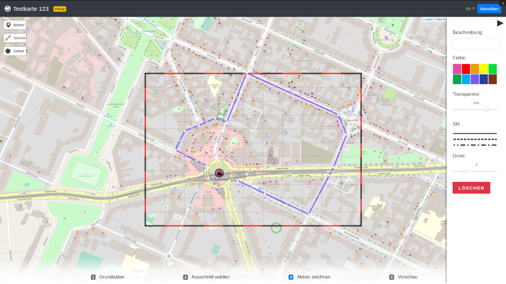

Anleitung
=========

Aktionskarten sollen Menschen helfen, sich auf einer Demo oder anderen
Veranstaltung zurecht zu finden. Mit Hilfes dieses Webdienst kannst du digitale
aber auch analoge Karten erstellen. Durch eine ausgedruckte Karte bist du
beispielsweise nicht auf dein Smartphone angewiesen. Hierdurch musst dir keine
Sorgen um leere Akkus, Handys in den falschen Händen oder etwaiger
Funkzellenabfragen machen.

Im Folgenden eine kleine Anleitung wie du eine Karte erstellst und am Ende
ausdruckst. Hierzu musst du folgende Schritte befolgen:

1. Metadaten deiner Karte (Name, Ort und Zeit)
2. Kartenausschnitt auswählen
3. Interessante Orte, Routen oder Gegenden markieren
4. Karten als PDF exportieren und ausdrucken
5. Karten auf deiner Aktion verteilen

Karte erstellen
---------------

Klicke [hier](https://staging.aktionskarten.org/#/de/maps/new) um eine neue
Aktionskarten zu erstellen und ihr einen Namen, Ort und Datum zu geben. Deine
Karte speicherst du indem du auf **Neue Aktionskarte erstellen** klickst.

Damit nur du und deine Freund\*innen die Karten bearbeiten können, wird für jede
Karte ein zufälliges Passwort generiert. Merke dir dieses, denn nur mit Hilfe
dieses Passwort kannst du die Karte auch weiterhin bearbeiten. Um es einfacher
zu gestalten, reicht es wenn du den Admin-Link dir abspeicherst. Hier ist das
Passwort im Link selber integriert. Falls du die Karte auch digital teilen
willst, dann machst du das indem du den Public-Link verwendest. Über diesen
ist die Karte nur einsehbar aber kann nicht verändert werden.

Kartenausschnitt wählen
----------------------

Bisher hat deine Karte nur einen Namen, Datum und Ort. Als nächstes markierst
du einen Kartenausschnitt. Hierzu klickst du auf **Zeichnen** und malst ein Din
A4-Rechteck. Dieser Ausschnitt wird am Ende auf deinem Ausdruck erscheinen.
Wenn du zufrieden mit deinem Ausschnitt bist, klicke auf **Weiter**. Ansonsten
versuche es erneut über **Neuzeichnen**.

Aktionskarten malen
-------------------

Meist ist es von Interesse, Orte, Routen oder Gegenden auf der Aktionskarte zu
kennzeichnen. Dies könnten zum Beispiel Kundgebungen, ganze Gegenden oder
Demostrecken sein. Im Folgenden exemplarisch wie du eine Demo darstellen
könntest:

1. Demoroute markieren
2. Start und Endpunkt als Marker hervorheben
3. Kundgebung markieren

Karten exportieren
------------------

Wenn du zufrieden mit deiner Karte bist, kannst du dir unter **Vorschau** die
Karte selbst angucken und auch in verschiedene Formate exportieren. Um die
Karte auszudrucken, würdest du nun auf **Herunterladen** klicken und PDF
auswählen. Das PDF kannst du jetzt ausdrucken und auf deiner Demo verteilen.

Die finale Version in verschiedenen Formaten kannst du hier finden:

* [PDF](imgs/final.pdf)
* [PNG](imgs/final.png)
* [SVG](imgs/final.svg)

Wenn du die Karte veröffentlichst, dann erscheint sie auf der Startseite von
aktionskarten.org. Ansonsten ist sie privat und auch nicht zu erraten, da ein
Teil der Map-Karten-URL zufällig generiert ist.
