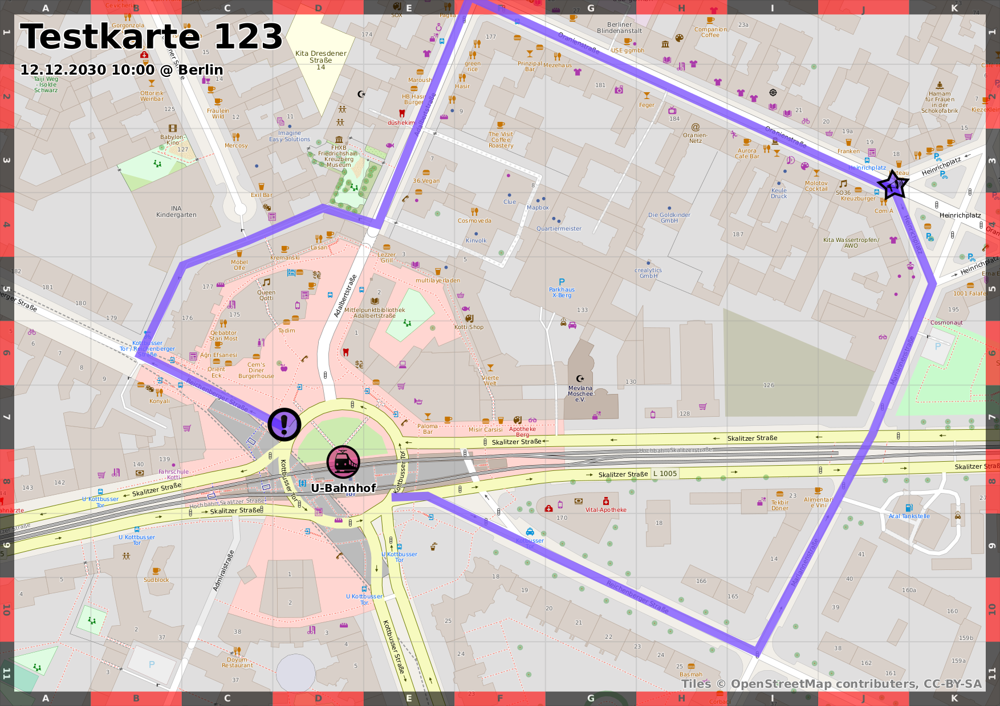

Brief tutorial
==============

ENGLISH

The Aktionskarten's purpose is to help people find their way around at a
protest or any other event. With this service you can create digital and
analogue maps. With a printed map in hand you don't have to rely on your
smart phone in critical situations. You don't have to worry about empty
batteries, wrong people getting hold of your phone, or possible cell site
analyses.

In what follows you can find a short tutorial on how to create and print a map. Here are
the steps to follow:

1. Provide the meta data of your map (e.g. name, location, and time)
2. Select a map extract
3. Mark interesting places, routes, or areas
4. Export the map as a PDF file and print it
5. Distribute copies of the printed map at the event

Create a map
------------

Click [here](https://staging.aktionskarten.org/#/en/maps/new) in order to create
a new map and give it a name, location, and appointed day and time.
To save the map, click on **Create new map**.

For every map, a random password is generated. This guarantees that only you
and your friends can edit the map. You should remember or save the password —
only with it you are able to continue editing the map. The easiest way is to
simply save the admin link for the map. Here, the password is integrated in the
link itself. If you want to share the digital map, use the public map link. It
enables people to view the map but not change it.

Select a map extract
--------------------

So far, your map only has a name, an appointed day and time, as well as a
location. In this step, you select a map extract. Click on **draw** to mark a
DIN A4 rectangle. This is the extract that will appear on your printout at the
end of the process. If you are satisfied with the extract, click on
**Continue**. Otherwise, you can click on **Redraw** and select a new rectangle.

Draw an action map
------------------

It is often necessary to mark specific locations, routes, or areas on the map.
For instance, if you want to depict the route for a rally, you should do
following:

1. Mark the route: select **Route** from the tiles on the left-hand side.
   Select the start and end point of the route. Click **Finish**.
2. Highlight start and endpoint by placing markers on them: select **Marker**
   on the left-hand side.

Export the map
--------------

When you are satisfied with your map, you can view the final result by selecting
**Preview** from the steps at the bottom of the screen. In the preview step, you
can also export the map in different file formats. If you want to print the map,
you should go to **Download** and select **Print (PDF)**. Print the pdf file
and distribute it at your rally.

Here, you can find the final version in different formats:

* 
* 
* 

If you decide to publish the map, it will be displayed on the home page of
aktionskarten.org. Otherwise, the map is not publicly viewable and the admin
link cannot be guessed since a part of it is randomly generated.
